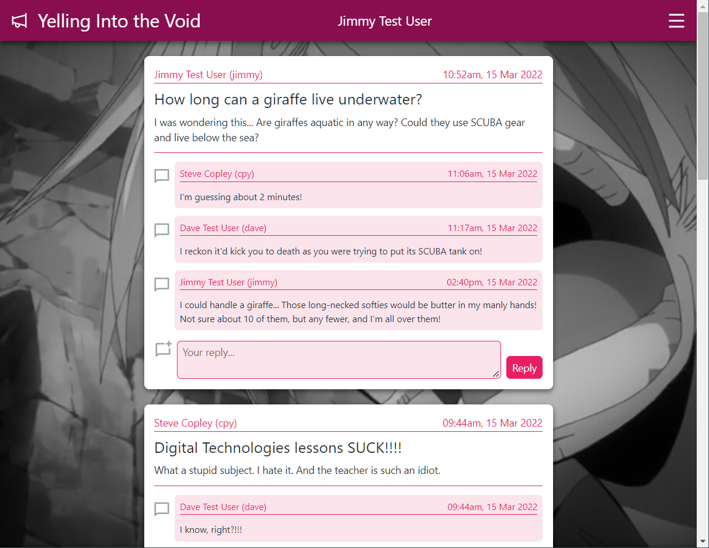
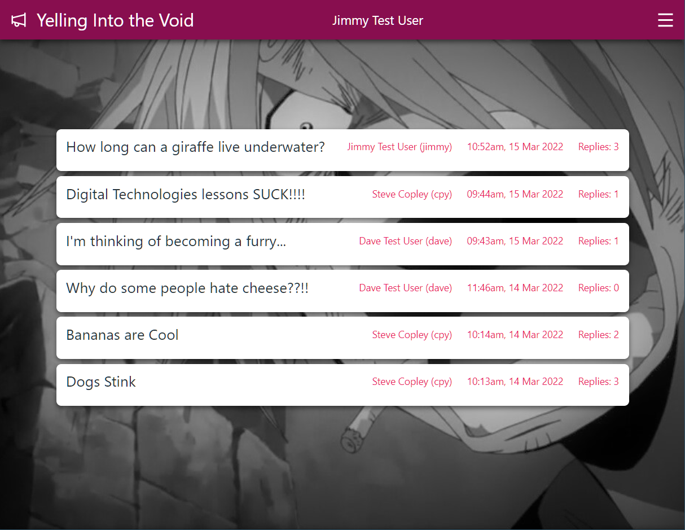
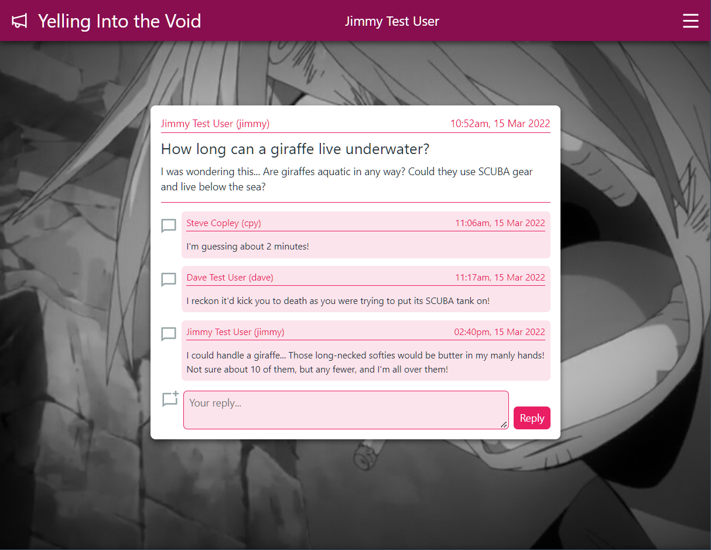
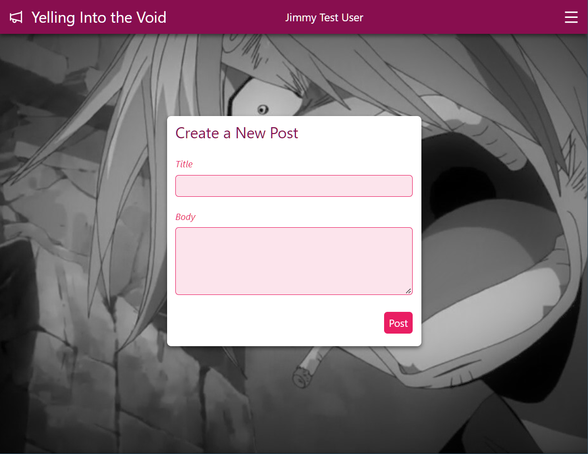
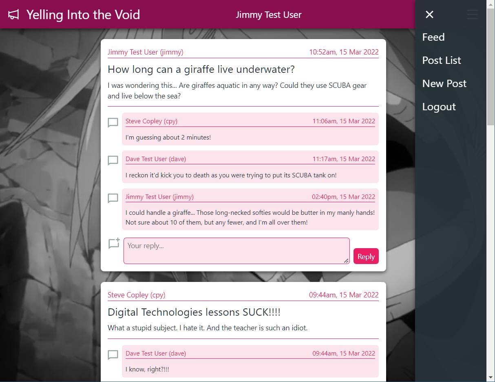

# Demo Project - A Forum with User Account

Demonstrates: 

- Creation of user accounts (with hashed & salted passwords)
- Logging in / out
- Use of session data
- Adaption of UI based on login status
- Some CRUD functionality:
   - Creation of new forum posts
   - Reading of existing posts
   - (No updating of posts)
   - (No deletion of posts)

Site has a simple but responsive UI, including:
- mobile-first design
- inline post / reply view (the feed)
- top-level post list, with links to full view and replies

## Screenshots

Post Feed

Post List

Post View

New Post

Menu

